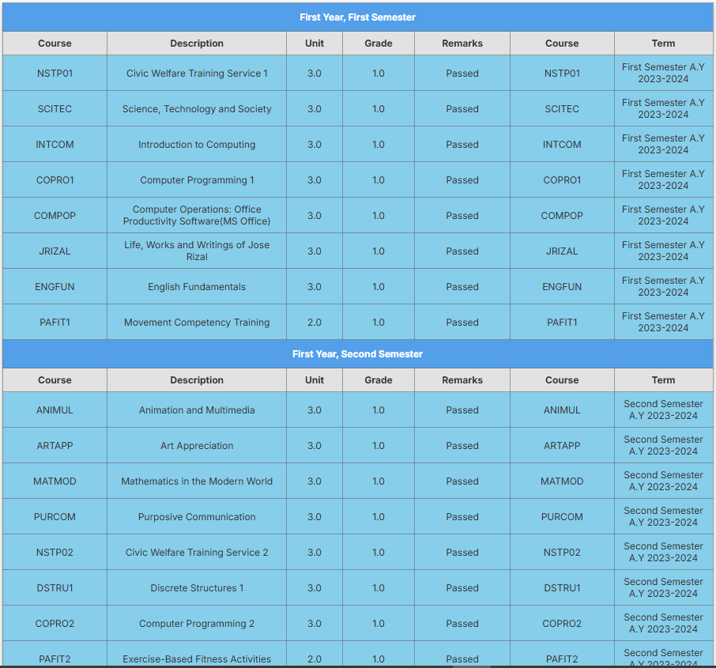

## Curriculum Table

This project is a simple HTML and CSS-based web page that displays a student's curriculum record across multiple semesters. It includes course details such as course codes, descriptions, units, grades, remarks, and academic terms. The layout is responsive and styled using an external CSS file.

## Project Structure

```
├── index.html # Main HTML file containing the curriculum table
├── style.css # External CSS file for styling the table and layout
└── README.md # Project documentation
```

## Features

- Displays courses organized by semester and academic year
- Responsive table layout
- Clean and modern typography using Google Fonts (Inter)
- Visual indication of passed courses via `passed` class
- Organized and semantic HTML structure

## Curriculum Sample

The curriculum table includes:

- **First Year, First Semester**
- **First Year, Second Semester**
- **Second Year, First Semester**

Each course displays the following:
- Course code
- Course description
- Units
- Grade
- Remarks
- Course code (again, for alignment or redundancy)
- Term (e.g., "First Semester A.Y 2023-2024")

## Technologies Used

- HTML5
- CSS3
- [Google Fonts - Inter](https://fonts.google.com/specimen/Inter)

## Screenshot



## Getting Started

To run this project locally:

1. Clone the repository:
   ```
   bash git clone https://github.com/rjayibina/curriculum-table.git

---

Let me know if you’d like to include a screenshot preview, a live link (GitHub Pages), or additional sections like accessibility or future improvements.